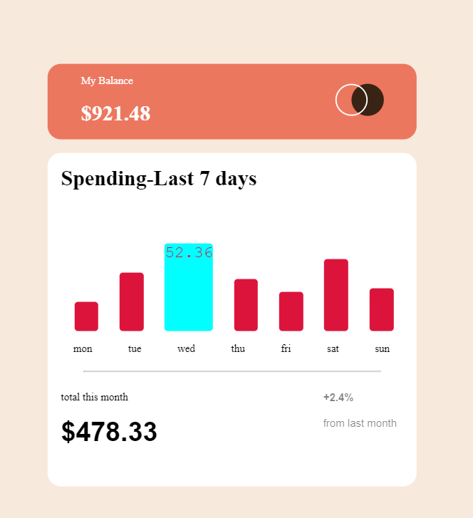
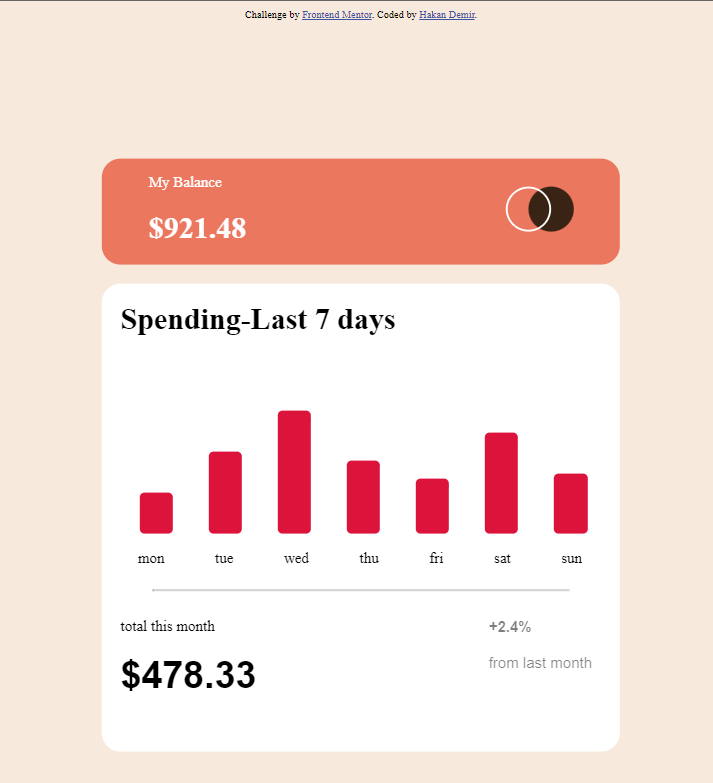

# Frontend Mentor - Expenses chart component solution

## Table of contents

- [Overview](#overview)
  - [The challenge](#the-challenge)
  - [Screenshot](#screenshot)
- [My process](#my-process)
  - [Built with](#built-with)
  - [What I learned](#what-i-learned)


## Overview

### The challenge

Users should be able to:

- View the bar chart and hover over the individual bars to see the correct amounts for each day
- See the current day’s bar highlighted in a different colour to the other bars
- View the optimal layout for the content depending on their device’s screen size
- See hover states for all interactive elements on the page
- **Bonus**: Use the JSON data file provided to dynamically size the bars on the chart

### Screenshot

,](./screenshot.jpg)


## My process

### Built with
  
- Semantic HTML5 markup
- CSS custom properties
- Flexbox
- CSS Grid


### What I learned


```js
const proudOfThisFunc = () => {
  console.log('let data = fetch("./data.json")
  .then((response) => response.json())
  .then((Datas) => {
    // console.log(JSON.stringify(Datas));

    let html = "";


    Datas.forEach((veri) => {
      html += `
                <li style= "height: ${2.5 * veri.amount}px;" >${
        veri.amount
      }</li>
        `;
    });

    document.querySelector("#data").innerHTML = html;

    let html2 = "";

    Datas.forEach((veri2) => {
      html2 += `
      <p>${veri2.day}<p/>
      `;
    });

    document.querySelector("#days").innerHTML = html2;
  });
')
}
```


